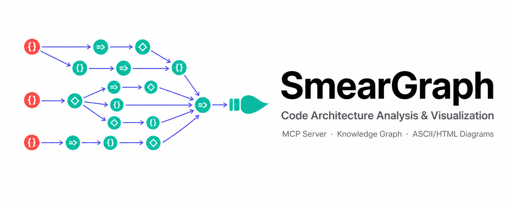

<a name="smeargraph"></a>
<p align="center">
  
</p>

<p align="center">
  <h1 align="center">🖌️ SmearGraph</h1>
  <p align="center">
    <strong>Code Architecture Analysis, Visualization & MCP Server</strong><br>
    <em>Paint your codebase like Smeargle — scan, graph, trace, visualize</em>
  </p>
  <p align="center">
    <a href="#-features">Features</a> •
    <a href="#-quick-start">Quick Start</a> •
    <a href="#-mcp-server">MCP Server</a> •
    <a href="#%EF%B8%8F-cli-reference">CLI</a> •
    <a href="#-tools-18">Tools</a>
  </p>
</p>

<p align="center">
  
  
  
  
  
  
</p>

<p align="center">
  <strong>English</strong> | <a href="README_ZH.md">中文</a>
</p>

---

## ✨ Features

<table>
  <tr>
    <td width="50%">
      <h3>🔍 Deep Code Analysis</h3>
      <ul>
        <li>Scan source files, extract symbols, trace call chains</li>
        <li>Build a SQLite-backed knowledge graph of your codebase</li>
        <li>Find circular dependencies, dead code, and blast radius</li>
        <li>"What breaks if I change X?" — answered instantly</li>
      </ul>
    </td>
    <td width="50%">
      <h3>🗺️ Architecture Visualization</h3>
      <ul>
        <li>ASCII diagram — works in any terminal</li>
        <li>Interactive HTML dashboard — component explorer</li>
        <li>JSON export — feed into any pipeline</li>
        <li>Runtime trace capture (Python)</li>
      </ul>
    </td>
  </tr>
  <tr>
    <td width="50%">
      <h3>🤖 MCP Server (AI-agent ready)</h3>
      <ul>
        <li>18 MCP tools for Claude Code, Codex, OpenCode</li>
        <li>Zero-config: just add to <code>claude.json</code></li>
        <li>Cross-session memory: store decisions and patterns</li>
        <li>LLM enrichment: auto-generate node summaries</li>
      </ul>
    </td>
    <td width="50%">
      <h3>⚡ Developer Experience</h3>
      <ul>
        <li>Zero configuration — <code>smeargraph init</code> just works</li>
        <li>Node 18+, TypeScript, tree-sitter parser</li>
        <li>Incremental sync with <code>chokidar</code> file watcher</li>
        <li>Agent instructions for Claude Code, Codex, OpenCode</li>
      </ul>
    </td>
  </tr>
</table>

<div align="right"><a href="#smeargraph">↑ back to top</a></div>

---

## 🚀 Quick Start

**① Install**

```bash
npm install -g smeargraph
# or use directly via npx
npx smeargraph init
```

**② Initialize your project**

```bash
cd your-project
smeargraph init      # Build knowledge graph + SQLite index
```

**③ Visualize architecture**

```bash
smeargraph analyze . -f ascii    # ASCII diagram in terminal
smeargraph analyze . -f html     # Open interactive HTML dashboard
smeargraph analyze . -f json     # JSON export
```

**④ Optional: enrich with LLM**

```bash
smeargraph enrich    # Auto-generate summaries for all nodes
```

<div align="right"><a href="#smeargraph">↑ back to top</a></div>

---

## 🤖 MCP Server

Add SmearGraph as a Claude Code MCP server — then ask questions about your code in plain English.

**Setup** (`claude.json`):

```json
{
  "mcpServers": {
    "smeargraph": {
      "command": "npx",
      "args": ["smeargraph", "serve"],
      "timeout": 300000
    }
  }
}
```

**Example queries in Claude Code:**

```
What calls the processPayment function?
What breaks if I rename UserService?
Are there any circular dependencies?
Show me the overall architecture
Find all dead code
What changed in this PR's diff?
```

<div align="right"><a href="#smeargraph">↑ back to top</a></div>

---

## 🛠️ Tools (18)

<details>
<summary><strong>Full MCP tool reference — click to expand</strong></summary>
<br>

**Primary**

| Tool | Purpose |
|------|---------|
| `smeargraph_explore` | **Call FIRST** — returns verbatim source for any code question |

**Code Analysis**

| Tool | Purpose |
|------|---------|
| `smeargraph_search` | Find symbol by name (faster than grep) |
| `smeargraph_impact` | "What breaks if I change X?" |
| `smeargraph_callers` | "What calls this?" |
| `smeargraph_callees` | "What does this call?" |
| `smeargraph_traverse` | Generic graph traversal with filters |
| `smeargraph_circular` | Find circular dependencies |
| `smeargraph_dead` | Find dead code |
| `smeargraph_pr_context` | Analyze git diff impact |

**Architecture**

| Tool | Purpose |
|------|---------|
| `smeargraph_architecture` | Full architecture overview |
| `smeargraph_component` | Component details |
| `smeargraph_trace` | Runtime trace (Python only) |
| `smeargraph_summary` | Node summary |

**Cross-session Memory**

| Tool | Purpose |
|------|---------|
| `smeargraph_memory_store` | Store decision / insight / pattern |
| `smeargraph_memory_search` | Search stored memories |
| `smeargraph_memory_list` | List all memories |
| `smeargraph_memory_stats` | Memory statistics |

**Meta**

| Tool | Purpose |
|------|---------|
| `smeargraph_status` | Check index health |

</details>

<div align="right"><a href="#smeargraph">↑ back to top</a></div>

---

## 🖥️ CLI Reference

<details>
<summary><strong>All CLI commands — click to expand</strong></summary>
<br>

```bash
smeargraph init                          # Initialize knowledge graph + SQLite index
smeargraph analyze [dir] -f ascii        # ASCII architecture diagram
smeargraph analyze [dir] -f html         # Interactive HTML dashboard
smeargraph analyze [dir] -f json         # JSON export
smeargraph trace --cmd "node app.js"     # Runtime trace (Python only for now)
smeargraph serve                         # Start MCP server on stdin/stdout
smeargraph enrich                        # Enrich nodes with LLM summaries
```

Flags:
```
-o, --output <path>       Output file path
-f, --format <format>     Output format: json | ascii | html (default: ascii)
-e, --exclude <patterns>  Comma-separated glob patterns to exclude
-d, --depth <number>      Max directory depth (default: 10)
```

</details>

<div align="right"><a href="#smeargraph">↑ back to top</a></div>

---

## 📁 Project Structure

```
SmearGraph/
├── src/
│   ├── analyzer/       # Source code parsing (tree-sitter)
│   ├── knowledge-graph/# Graph construction, merge, schema
│   ├── db/             # SQLite index + migration
│   ├── mcp/            # MCP server (18 tools)
│   ├── visualizer/     # ASCII + HTML renderers
│   ├── tracer/         # Runtime trace capture
│   ├── llm/            # LLM enrichment
│   ├── memory/         # Cross-session memory layer
│   └── cli.ts          # CLI entry point
├── agents/
│   ├── claude-code.md  # Agent instructions for Claude Code
│   ├── codex.md        # Agent instructions for Codex
│   └── opencode.md     # Agent instructions for OpenCode
└── package.json
```

<div align="right"><a href="#smeargraph">↑ back to top</a></div>

---

## 🧪 Development

```bash
git clone https://github.com/GetIT-Sunday/SmearGraph.git
cd SmearGraph
npm install
npm run build   # Compile TypeScript
npm start       # Start CLI
```

<div align="right"><a href="#smeargraph">↑ back to top</a></div>

---

## 🤝 Contributing

Contributions welcome — open an issue or PR.

<div align="right"><a href="#smeargraph">↑ back to top</a></div>

---

## 📄 License

MIT — see [LICENSE](LICENSE) for details.

---

<p align="center">
  <strong>⭐ If SmearGraph helped you understand your codebase, give it a Star!</strong>
</p>

<p align="center">
  <a href="https://star-history.com/#GetIT-Sunday/SmearGraph&Date">
    
  </a>
</p>

<p align="center">
  <sub>Made with ✨ by <a href="https://github.com/GetIT-Sunday">GetIT-Sunday</a> using <a href="https://github.com/GetIT-Sunday/ReadmeMagic-github-readme-design-skill">ReadmeMagic</a></sub>
</p>
